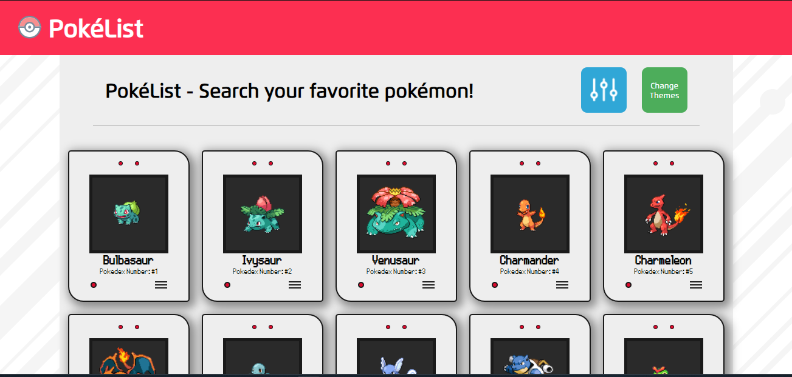

# PokéList - Pokémon API Consumer Project
## Overview


> The project is a website which consumes the public Pokémon API, listing each one pokémon in cards, being possible to access a page with details. It's possible to navigate through pages, and there's a theme-toggler system.

### Description

Users should be able to:

- Scroll through pokémon's 10 at a time, according to the Pokédex Order;
- See a image, name and pokédex ID of the pokémon on cards;
- When clicking the "Show more" button, it should load 10 more pokémon;
- Change between "Dark" and "Light" themes;
- When clicking any card, navigate to the pokémon details page;
- Navigate to prev and next pokémon inside of the pokémon details page.

### Adjustments and Improvements

The project is still in development, so there's few things that will be corrected, enhanced, and new features are coming by:

- Add a search filter feature;
- Add more info of the pokémon;
- Improve code;
- Add tests runners with Jest;
- And more!

## My process

### Built with

- [React](https://legacy.reactjs.org) - as Framework
- [Axios](https://axios-http.com/ptbr/docs/intro) - For API actions
- [React Router](https://reactrouter.com/en/main) - For URL navigation and SPA uses
- [Context API](https://legacy.reactjs.org/docs/context.html) - For Theme Toggler use
- [Styled Components](https://styled-components.com/) - For styles
- [React Icons](https://react-icons.github.io/react-icons/) - For Icons


## 🚀 Installing poke-list-api

To install poke-list-api, follow these steps:

Windows:

```
git clone <project_url>
```

And then you're free to use!

## Links

- Repository URL: [poke-list-api](https://github.com/devito96/poke-list-api)
- Pokémon API Documentation URL: [Pokémon API](https://pokeapi.co/docs/v2)


## Author
Vitor Hugo

- GitHub - [@devito96](https://github.com/devito96)
- LinkedIn - [Vitor Hugo](https://www.linkedin.com/in/vitor-hugo-ojeda-johann-060410271/)
- Twitter - [@vitorugoj](https://www.twitter.com/vitorugoj) (inactive)
- Discord - [@vhugo2000]()